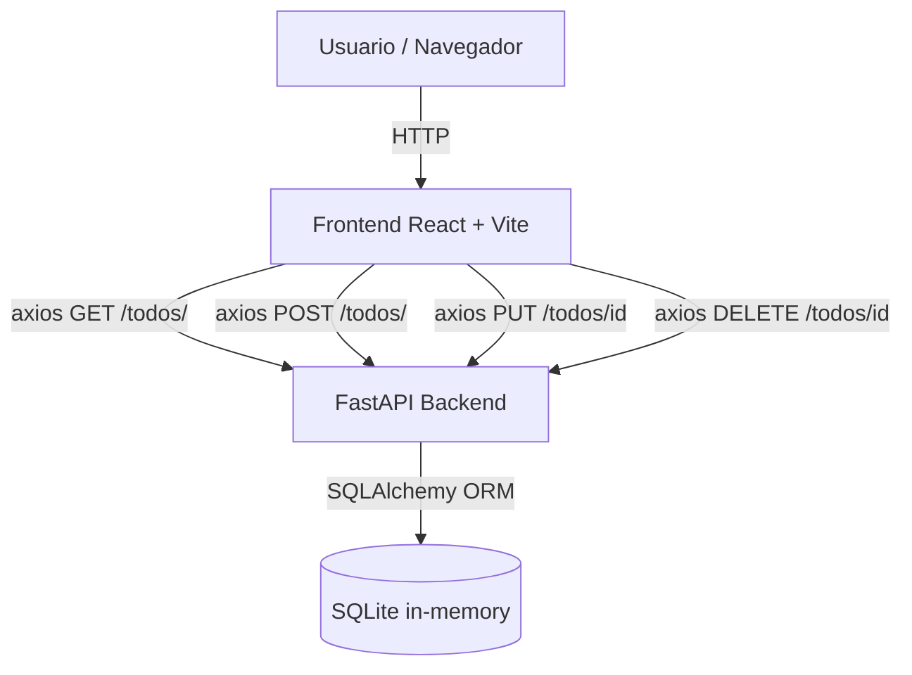

# Especificaciones Funcionales E2E — py-todo-list

**Proyecto:** py-todo-list  
**Fecha:** 2026-05-28  
**Versión:** 1.0  
**Analista:** GitHub Copilot (e2e_functional_test_generator)

---

## Índice

- [Resumen de Arquitectura](#resumen-de-arquitectura)
- [Fichas Funcionales por Módulo](#fichas-funcionales-por-módulo)
- [Tier 1 — Críticos (5 tests)](#tier-1--críticos-5-tests)
- [Tier 2 — Importantes (10 tests)](#tier-2--importantes-10-tests)
- [Tier 3 — Complementarios (15 tests)](#tier-3--complementarios-15-tests)

---

## Resumen de Arquitectura



**Repositorio único** (monorepo):

| Capa | Tecnología | Ruta principal |
|------|-----------|----------------|
| Frontend | React 18, TypeScript, Vite, TanStack Query | `frontend/src/` |
| Backend | Python 3, FastAPI, SQLAlchemy | `app/` |
| Base de datos | SQLite en memoria | runtime |

**Base URL API:** `http://localhost:8000`

---

## Fichas Funcionales por Módulo

### Frontend — `App.tsx`

- **Tipo:** Frontend / Orquestador
- **Propósito:** Componente raíz. Coordina estado global: filtro activo, apertura del formulario y tarea en edición.
- **Entradas:** Interacción del usuario (clics, formulario), respuestas de la API vía hooks de React Query.
- **Salidas:** Lista de tareas filtradas renderizada, apertura/cierre del diálogo `TodoForm`.
- **Validaciones observadas:** El filtro local se aplica en cliente; no envía parámetro `completed` a la API cuando el filtro es `"all"`.
- **Errores/mensajes:** Estado de carga: spinner `Loader2`. Error de API: no existe manejo de error visible en UI (no encontrado en el código revisado).
- **Dependencias:** `useTodos`, `useCreateTodo`, `useUpdateTodo`, `useDeleteTodo`, `useDarkMode`.
- **Datos sensibles:** No.

### Frontend — `TodoForm.tsx`

- **Tipo:** Frontend / Formulario modal
- **Propósito:** Diálogo para crear o editar una tarea. Reutiliza el mismo componente con `initialData` para diferenciar modo.
- **Entradas:** `title` (string, obligatorio), `description` (string, opcional). Se aplica `.trim()` en submit.
- **Salidas:** Callback `onSubmit({ title, description })` al componente padre.
- **Validaciones observadas:** Botón de submit deshabilitado si `title.trim()` es vacío. No tiene validación de longitud máxima.
- **Errores/mensajes:** No muestra mensaje de error inline; el botón simplemente permanece deshabilitado.
- **Dependencias:** `Dialog`, `Input`, `Textarea`, `Button` (UI primitives).
- **Datos sensibles:** No.

### Frontend — `TodoCard.tsx`

- **Tipo:** Frontend / Tarjeta de tarea
- **Propósito:** Renderiza una tarea individual con acciones: toggle completado, editar, eliminar.
- **Entradas:** `Todo` (id, title, description, completed, created_at).
- **Salidas:** Callbacks `onToggle`, `onEdit`, `onDelete`.
- **Validaciones observadas:** `isDeleting` deshabilita el botón de eliminar tras el primer clic (evita doble envío).
- **Errores/mensajes:** Opacidad reducida al eliminar (`opacity-50`). Título tachado si `completed === true`.
- **Dependencias:** `Checkbox`, `Button`, `Card` (UI primitives).
- **Datos sensibles:** No.

### Frontend — `FilterBar.tsx`

- **Tipo:** Frontend / Barra de filtros
- **Propósito:** Filtra la lista visible según estado: All / Pending / Completed.
- **Entradas:** `value: FilterValue`, callback `onChange`.
- **Salidas:** Valor de filtro activo al padre (`App.tsx`).
- **Validaciones observadas:** Filtro aplicado localmente en `App.tsx`; no recarga desde API.
- **Errores/mensajes:** No aplica.
- **Dependencias:** Ninguna externa.
- **Datos sensibles:** No.

### Frontend — `useDarkMode.ts`

- **Tipo:** Frontend / Hook personalizado
- **Propósito:** Persiste preferencia de tema oscuro en `localStorage`; detecta preferencia del sistema como valor inicial.
- **Entradas:** `localStorage.darkMode`, `window.matchMedia('prefers-color-scheme: dark')`.
- **Salidas:** `isDark: boolean`, `toggle()`.
- **Validaciones observadas:** Catch silencioso si `localStorage` no está disponible.
- **Errores/mensajes:** No.
- **Dependencias:** Web API: `localStorage`, `matchMedia`.
- **Datos sensibles:** No.

### Backend — `app/routers/todos.py`

- **Tipo:** Backend / API REST
- **Propósito:** CRUD completo de tareas.
- **Entradas:** JSON body para POST/PUT; path param `todo_id` para GET/PUT/DELETE; query param `completed` para GET list.
- **Salidas:** `TodoResponse` serializado vía Pydantic.
- **Validaciones observadas:** `title` obligatorio (no puede ser null ni ausente). `description` opcional. `completed` por defecto `False`.
- **Errores/mensajes:** `404 Not Found` con `{"detail": "Todo not found"}` cuando `todo_id` no existe.
- **Dependencias:** SQLAlchemy Session, modelo `Todo`.
- **Datos sensibles:** No.

### Backend — `app/models.py` / `app/schemas.py`

- **Tipo:** Backend / Modelo de datos
- **Propósito:** Define la entidad `Todo` en BD y los esquemas de validación Pydantic.
- **Campos críticos:**

  | Campo | Tipo | Requerido | Default |
  |-------|------|-----------|---------|
  | `id` | int PK | auto | autoincrement |
  | `title` | string | sí | — |
  | `description` | string nullable | no | null |
  | `completed` | bool | no | false |
  | `created_at` | datetime | no | utcnow() |
  | `updated_at` | datetime | no | utcnow() / onupdate |

- **Datos sensibles:** No.

---

## Tier 1 — Críticos (5 tests)

> 🔴 Bloquean el uso principal de la aplicación si fallan.

---

### TEST-T1-001: Crear Nueva Tarea con Título

#### Información General

- **ID:** TEST-T1-001
- **Tier:** 1 - Crítico
- **Prioridad:** Alta
- **Tipo:** Smoke Test
- **Estimación implementación:** 2 horas

#### Objetivo del Test

**Qué se prueba:**  
El flujo completo de creación de una tarea desde el formulario del frontend hasta su persistencia en la base de datos y visualización en la lista.

**Por qué es crítico:**  
Es la funcionalidad principal de la aplicación. Sin poder crear tareas, la app es completamente inútil.

#### Arquitectura Involucrada

**Repositorios afectados:**

- **Frontend:** `frontend/src/components/TodoForm.tsx` — Formulario modal de creación
- **Frontend:** `frontend/src/hooks/useTodos.ts` — Mutación `useCreateTodo` + invalidación de caché
- **Frontend:** `frontend/src/api/client.ts` — `POST /todos/`
- **Backend:** `app/routers/todos.py` — Endpoint `POST /todos/`
- **Backend:** `app/models.py` — Modelo `Todo`

**Flujo técnico:**

```text
1. Usuario → Click "New Task" → App.tsx abre formOpen=true
2. App.tsx → TodoForm renderiza Dialog con inputs vacíos
3. Usuario ingresa title → onSubmit({ title, description })
4. App.tsx.handleFormSubmit → useCreateTodo.mutate({ title, description })
5. api/client.ts → POST http://localhost:8000/todos/ { title, description }
6. Backend todos.py.create_todo → Todo(**data) → db.add() → db.commit()
7. Backend → HTTP 201 { id, title, description, completed:false, created_at, updated_at }
8. TanStack Query onSuccess → invalidateQueries(["todos"])
9. useTodos re-fetch → GET /todos/ → lista actualizada
10. TodoList re-renderiza con nueva tarea visible
```

#### Detalle Funcional por Módulo

- **Módulo:** `TodoForm.tsx`
  - **Tipo:** Frontend
  - **Propósito:** Capturar título y descripción de la nueva tarea
  - **Entradas:** Texto libre en inputs `title` y `description`
  - **Salidas:** `onSubmit({ title: title.trim(), description: description.trim() })`
  - **Validaciones observadas:** Submit deshabilitado si `title.trim() === ""`; limpia campos y cierra dialog tras submit exitoso
  - **Errores/mensajes:** Botón deshabilitado (sin mensaje)
  - **Dependencias:** `Dialog`, `Input`, `Textarea`, `Button`
  - **Datos sensibles:** No

- **Módulo:** `todos.py → create_todo`
  - **Tipo:** Backend
  - **Propósito:** Persistir nueva tarea en SQLite
  - **Entradas:** `TodoCreate { title: str, description: str | None }`
  - **Salidas:** `TodoResponse` HTTP 201
  - **Validaciones observadas:** `title` campo obligatorio en Pydantic (falla 422 si ausente)
  - **Errores/mensajes:** 422 Unprocessable Entity si body inválido
  - **Dependencias:** SQLAlchemy Session, modelo Todo
  - **Datos sensibles:** No

#### Contratos y Transacciones

- **API:** `POST /todos/`
  - **Request:**

    ```json
    {
      "title": "string (obligatorio, no vacío)",
      "description": "string | null (opcional)"
    }
    ```

  - **Response HTTP 201:**

    ```json
    {
      "id": 1,
      "title": "string",
      "description": "string | null",
      "completed": false,
      "created_at": "2026-05-28T10:00:00",
      "updated_at": "2026-05-28T10:00:00"
    }
    ```

  - **Error:** 422 si `title` ausente; 500 si BD no disponible

#### Fuentes Revisadas

- `frontend/src/components/TodoForm.tsx`
- `frontend/src/hooks/useTodos.ts`
- `frontend/src/api/client.ts`
- `app/routers/todos.py`
- `app/schemas.py`
- `app/models.py`

#### Comportamiento Esperado

##### Escenario Principal: Happy Path — Crear tarea con título

**Precondiciones:**

- [ ] Backend FastAPI corriendo en `http://localhost:8000`
- [ ] Frontend corriendo en `http://localhost:5173`
- [ ] Base de datos SQLite inicializada (automático al arrancar)

**Pasos del usuario:**

1. El usuario navega a la app (URL: `http://localhost:5173`)
2. El usuario hace clic en el botón **"New Task"** (esquina superior derecha)
3. El dialog "New Task" se abre con campos vacíos
4. El usuario escribe `"Comprar leche"` en el campo **Task title**
5. El usuario hace clic en el botón **"Create Task"**
6. El dialog se cierra automáticamente
7. La nueva tarea aparece en la lista

**Resultado esperado:**

- ✅ La tarea `"Comprar leche"` aparece en la lista de tareas
- ✅ La tarea tiene estado pendiente (checkbox desmarcado)
- ✅ Se muestra la fecha de creación formateada
- ✅ El dialog se cierra y los campos se limpian
- ✅ Tiempo de respuesta < 2 segundos

**Datos de prueba necesarios:**

```json
{
  "escenario_principal": {
    "title": "Comprar leche",
    "description": null,
    "expected_completed": false
  }
}
```

##### Escenario Alternativo 1: Título vacío — Botón deshabilitado

**Qué probar:**  
Que no se puede enviar el formulario con el título vacío o solo espacios.

**Pasos:**

1. Abrir dialog "New Task"
2. Dejar el campo de título vacío (o ingresar solo espacios)
3. Intentar hacer clic en "Create Task"

**Resultado esperado:**

- ❌ No se envía la petición `POST /todos/`
- ✅ El botón "Create Task" permanece deshabilitado
- ✅ El dialog permanece abierto

##### Escenario Alternativo 2: Backend no disponible

**Qué probar:**  
Comportamiento del frontend cuando el backend no responde.

**Pasos:**

1. Detener el servidor FastAPI
2. Abrir dialog "New Task"
3. Ingresar título y hacer clic en "Create Task"

**Resultado esperado:**

- ❌ La tarea NO aparece en la lista
- ✅ La petición falla (network error)
- ✅ TanStack Query registra error en estado de mutación

#### Validaciones Clave

**Frontend:**

- [ ] Botón "Create Task" deshabilitado con título vacío
- [ ] Dialog se cierra automáticamente tras submit exitoso
- [ ] Lista se actualiza sin reload de página (invalidación de caché)

**Backend:**

- [ ] HTTP 201 al crear tarea válida
- [ ] `completed` inicializado en `false`
- [ ] `created_at` y `updated_at` generados automáticamente

**Integración:**

- [ ] La tarea persiste y aparece en el siguiente `GET /todos/`
- [ ] El `id` asignado por la BD se refleja en la UI

#### Puntos de Falla Críticos

1. **Backend no inicia** (SQLite/FastAPI falla al arrancar)
   - Impacto: App completamente no funcional
   - Detección: `GET /todos/` retorna error de red
   - Mensaje esperado: Spinner infinito o error de red en consola

2. **CORS bloqueado** (configuración CORS incorrecta)
   - Impacto: Todas las peticiones del frontend fallan
   - Detección: Error CORS en consola del navegador
   - Mensaje esperado: No encontrado en UI (bug)

#### Métricas a Capturar

- Tiempo de respuesta `POST /todos/` (target < 500ms)
- Tiempo hasta actualización visual de la lista (target < 1s)
- Tasa de éxito de creación

#### Dependencias y Consideraciones

**Dependencias externas:** SQLite en memoria (se reinicia al reiniciar el servidor)

**Consideraciones de ambiente:**

- La BD en memoria se pierde al reiniciar FastAPI; cada sesión de test empieza limpia
- El frontend filtra localmente; la creación siempre muestra la tarea en filtro "All"

#### Referencias

- **API Docs:** No disponible (Swagger deshabilitado: `docs_url=None`)
- **Código fuente Backend:** `app/routers/todos.py`
- **Código fuente Frontend:** `frontend/src/components/TodoForm.tsx`

---

### TEST-T1-002: Cargar Lista de Tareas al Iniciar

#### Información General

- **ID:** TEST-T1-002
- **Tier:** 1 - Crítico
- **Prioridad:** Alta
- **Tipo:** Smoke Test
- **Estimación implementación:** 1.5 horas

#### Objetivo del Test

**Qué se prueba:**  
Que la aplicación carga y muestra correctamente todas las tareas existentes al abrir la app por primera vez (o al recargar la página).

**Por qué es crítico:**  
Es el punto de entrada de la aplicación. Si la carga inicial falla, el usuario no ve ninguna tarea y no puede operar.

#### Arquitectura Involucrada

**Repositorios afectados:**

- **Frontend:** `frontend/src/App.tsx` — Estado de carga `isLoading`
- **Frontend:** `frontend/src/hooks/useTodos.ts` — Hook `useTodos` / `useQuery`
- **Frontend:** `frontend/src/api/client.ts` — `fetchTodos()`
- **Backend:** `app/routers/todos.py` — `GET /todos/`

**Flujo técnico:**

```text
1. Navegador carga http://localhost:5173
2. React monta App → useTodos() activa useQuery(["todos"])
3. api/client.ts → GET http://localhost:8000/todos/
4. Backend todos.py.list_todos → db.query(Todo).all()
5. Backend → HTTP 200 [{ id, title, description, completed, created_at, updated_at }, ...]
6. useTodos retorna data=[...], isLoading=false
7. App.tsx → filtra según filtro activo ("all") → pasa todos a TodoList
8. TodoList renderiza TodoCard por cada tarea
```

#### Detalle Funcional por Módulo

- **Módulo:** `useTodos` (TanStack Query)
  - **Tipo:** Frontend / Hook
  - **Propósito:** Gestionar el ciclo de vida de la petición GET con caché
  - **Entradas:** Ninguna
  - **Salidas:** `{ data: Todo[], isLoading, isError }`
  - **Validaciones observadas:** `data` default `[]` (nunca undefined en la UI)
  - **Errores/mensajes:** `isLoading` muestra spinner `Loader2`
  - **Dependencias:** TanStack Query, `fetchTodos`
  - **Datos sensibles:** No

#### Contratos y Transacciones

- **API:** `GET /todos/`
  - **Request:** Sin body. Query param opcional: `?completed=true|false`
  - **Response HTTP 200:**

    ```json
    [
      {
        "id": 1,
        "title": "string",
        "description": "string | null",
        "completed": false,
        "created_at": "2026-05-28T10:00:00",
        "updated_at": "2026-05-28T10:00:00"
      }
    ]
    ```

  - **Response vacío:** `[]`

#### Fuentes Revisadas

- `frontend/src/App.tsx`
- `frontend/src/hooks/useTodos.ts`
- `frontend/src/api/client.ts`
- `app/routers/todos.py`

#### Comportamiento Esperado

##### Escenario Principal: Carga inicial con tareas existentes

**Precondiciones:**

- [ ] Backend corriendo con al menos 1 tarea precreada en BD
- [ ] Frontend accesible en `http://localhost:5173`

**Pasos del usuario:**

1. El usuario navega a `http://localhost:5173`
2. El spinner de carga es visible brevemente
3. La lista de tareas se renderiza

**Resultado esperado:**

- ✅ Spinner `Loader2` visible durante la carga
- ✅ Lista de tareas aparece cuando `isLoading === false`
- ✅ Cada tarea muestra título, fecha de creación y estado de completado correcto
- ✅ Tiempo de carga < 2 segundos

##### Escenario Alternativo 1: BD vacía — Estado vacío

**Qué probar:**  
Que la UI muestra el estado vacío cuando no hay tareas.

**Pasos:**

1. Backend arranca con BD en memoria vacía
2. El usuario navega a la app

**Resultado esperado:**

- ✅ Ícono `ClipboardList` visible
- ✅ Texto "No tasks found"
- ✅ Subtexto "Create a new task to get started"
- ❌ No se muestran `TodoCard`s

#### Validaciones Clave

**Frontend:**

- [ ] Spinner visible durante `isLoading === true`
- [ ] Spinner desaparece al recibir respuesta
- [ ] Estado vacío renderizado cuando `filteredTodos.length === 0`

**Backend:**

- [ ] HTTP 200 con array (vacío o con elementos)
- [ ] Campos `created_at` y `updated_at` en formato ISO 8601

**Integración:**

- [ ] Todos los campos de `TodoResponse` mapeados a la UI correctamente

#### Puntos de Falla Críticos

1. **Backend no disponible en arranque**
   - Impacto: Spinner infinito; usuario no ve nada
   - Detección: `isLoading` nunca pasa a `false`
   - Mensaje esperado: No encontrado en UI (mejora sugerida: manejo de `isError`)

2. **CORS no configurado para el origen del frontend**
   - Impacto: Petición bloqueada
   - Detección: Error de CORS en consola

#### Métricas a Capturar

- Tiempo hasta primer render de lista (target < 1s en localhost)
- Número de items cargados por petición

#### Referencias

- `app/routers/todos.py` — `list_todos`
- `frontend/src/hooks/useTodos.ts`

---

### TEST-T1-003: Marcar Tarea como Completada

#### Información General

- **ID:** TEST-T1-003
- **Tier:** 1 - Crítico
- **Prioridad:** Alta
- **Tipo:** Smoke Test
- **Estimación implementación:** 2 horas

#### Objetivo del Test

**Qué se prueba:**  
El flujo completo de marcar una tarea como completada mediante el checkbox, incluyendo la actualización en backend y el reflejo visual en la UI.

**Por qué es crítico:**  
Es la interacción más frecuente en una app de tareas. Sin esta funcionalidad el usuario no puede gestionar su progreso.

#### Arquitectura Involucrada

- **Frontend:** `frontend/src/components/TodoCard.tsx` — Checkbox `onChange`
- **Frontend:** `frontend/src/App.tsx` — `handleToggle`
- **Frontend:** `frontend/src/hooks/useTodos.ts` — `useUpdateTodo`
- **Frontend:** `frontend/src/api/client.ts` — `PUT /todos/{id}`
- **Backend:** `app/routers/todos.py` — `update_todo`

**Flujo técnico:**

```text
1. Usuario → Click checkbox en TodoCard (todo.completed=false)
2. TodoCard.onChange → App.handleToggle(id, !completed) → true
3. useUpdateTodo.mutate({ id, data: { completed: true } })
4. api/client.ts → PUT http://localhost:8000/todos/{id} { completed: true }
5. Backend.update_todo → setattr(todo, "completed", True) → db.commit()
6. Backend → HTTP 200 TodoResponse actualizado (completed: true)
7. TanStack Query onSuccess → invalidateQueries(["todos"])
8. Lista actualizada: título con tachado, checkbox marcado
```

#### Contratos y Transacciones

- **API:** `PUT /todos/{todo_id}`
  - **Request:**

    ```json
    { "completed": true }
    ```

  - **Response HTTP 200:**

    ```json
    {
      "id": 1,
      "title": "string",
      "completed": true,
      "updated_at": "2026-05-28T10:05:00"
    }
    ```

  - **Error:** 404 si `todo_id` no existe

#### Fuentes Revisadas

- `frontend/src/components/TodoCard.tsx`
- `frontend/src/App.tsx`
- `frontend/src/hooks/useTodos.ts`
- `app/routers/todos.py`

#### Comportamiento Esperado

##### Escenario Principal: Marcar tarea pendiente como completada

**Precondiciones:**

- [ ] Existe al menos una tarea con `completed=false`
- [ ] Backend y frontend corriendo

**Pasos del usuario:**

1. El usuario ve la lista de tareas
2. El usuario hace clic en el checkbox de una tarea pendiente
3. El sistema envía `PUT /todos/{id}` con `{ completed: true }`

**Resultado esperado:**

- ✅ Checkbox aparece marcado
- ✅ Título de la tarea muestra estilo tachado (`line-through`)
- ✅ Texto del título pasa a `text-muted-foreground` (gris)
- ✅ `updated_at` actualizado en BD
- ✅ Tiempo de respuesta < 2 segundos

##### Escenario Alternativo 1: Toggle inverso (completada → pendiente)

**Qué probar:**  
Que se puede desmarcar una tarea completada.

**Pasos:**

1. Existe una tarea con `completed=true`
2. El usuario hace clic en el checkbox marcado

**Resultado esperado:**

- ✅ `PUT /todos/{id}` enviado con `{ completed: false }`
- ✅ Checkbox desmarcado
- ✅ Título sin tachado ni estilo `muted`

#### Validaciones Clave

**Frontend:**

- [ ] Checkbox visualmente cambia estado de inmediato (o tras respuesta exitosa)
- [ ] Estilo `line-through` aplicado únicamente cuando `completed === true`

**Backend:**

- [ ] Solo `completed` es actualizado (PATCH parcial vía `exclude_unset=True`)
- [ ] `updated_at` se actualiza con `datetime.utcnow()`

**Integración:**

- [ ] El estado persiste si se recarga la página

#### Puntos de Falla Críticos

1. **`todo_id` no encontrado en BD**
   - Impacto: HTTP 404; la UI no refleja el cambio
   - Detección: Error en TanStack Query mutation

#### Métricas a Capturar

- Tiempo de respuesta `PUT /todos/{id}` (target < 500ms)

#### Referencias

- `app/routers/todos.py` — `update_todo`
- `frontend/src/components/TodoCard.tsx`

---

### TEST-T1-004: Eliminar una Tarea

#### Información General

- **ID:** TEST-T1-004
- **Tier:** 1 - Crítico
- **Prioridad:** Alta
- **Tipo:** Smoke Test
- **Estimación implementación:** 2 horas

#### Objetivo del Test

**Qué se prueba:**  
El flujo completo de eliminación de una tarea, desde el botón de eliminar en la tarjeta hasta la desaparición de la UI y la eliminación en BD.

**Por qué es crítico:**  
Sin poder eliminar tareas, la lista crece indefinidamente y se vuelve inmanejable.

#### Arquitectura Involucrada

- **Frontend:** `frontend/src/components/TodoCard.tsx` — `handleDelete`, estado `isDeleting`
- **Frontend:** `frontend/src/App.tsx` — `handleDelete`
- **Frontend:** `frontend/src/hooks/useTodos.ts` — `useDeleteTodo`
- **Frontend:** `frontend/src/api/client.ts` — `DELETE /todos/{id}`
- **Backend:** `app/routers/todos.py` — `delete_todo`

**Flujo técnico:**

```text
1. Usuario → Click ícono Trash2 en TodoCard
2. TodoCard.handleDelete → setIsDeleting(true) → onDelete(todo.id)
3. App.handleDelete → useDeleteTodo.mutate(id)
4. api/client.ts → DELETE http://localhost:8000/todos/{id}
5. Backend.delete_todo → db.delete(todo) → db.commit()
6. Backend → HTTP 204 No Content
7. TanStack Query onSuccess → invalidateQueries(["todos"])
8. Lista actualizada: tarea desaparece
```

#### Contratos y Transacciones

- **API:** `DELETE /todos/{todo_id}`
  - **Request:** Sin body
  - **Response HTTP 204:** Sin cuerpo
  - **Error:** 404 si `todo_id` no existe

#### Fuentes Revisadas

- `frontend/src/components/TodoCard.tsx`
- `frontend/src/App.tsx`
- `frontend/src/hooks/useTodos.ts`
- `app/routers/todos.py`

#### Comportamiento Esperado

##### Escenario Principal: Eliminar tarea existente

**Precondiciones:**

- [ ] Existe al menos una tarea en la lista
- [ ] Backend y frontend corriendo

**Pasos del usuario:**

1. El usuario ve la lista de tareas
2. El usuario hace clic en el ícono de papelera (Trash2) de una tarea
3. La tarea muestra opacidad reducida inmediatamente
4. La tarea desaparece de la lista

**Resultado esperado:**

- ✅ Opacidad `opacity-50` aplicada durante la eliminación
- ✅ Botón de eliminar deshabilitado durante `isDeleting=true`
- ✅ Tarea desaparece de la lista tras respuesta HTTP 204
- ✅ BD ya no contiene el registro
- ✅ Tiempo de respuesta < 2 segundos

##### Escenario Alternativo 1: Eliminar tarea no existente (race condition)

**Qué probar:**  
Que el backend retorna 404 si la tarea ya fue eliminada.

**Pasos:**

1. Dos instancias o peticiones eliminan la misma tarea simultáneamente

**Resultado esperado:**

- ✅ Backend retorna `404 { "detail": "Todo not found" }`
- ✅ Frontend muestra error en TanStack Query (sin crash visible)

#### Validaciones Clave

**Frontend:**

- [ ] `isDeleting=true` deshabilita botón eliminar
- [ ] Opacidad `opacity-50` durante eliminación
- [ ] Lista actualizada sin recargar página

**Backend:**

- [ ] HTTP 204 sin cuerpo
- [ ] Registro eliminado de la tabla `todos`

**Integración:**

- [ ] Tarea no aparece en `GET /todos/` posterior

#### Puntos de Falla Críticos

1. **Backend retorna 404**
   - Impacto: Tarea permanece en UI hasta próximo re-fetch
   - Mensaje esperado: Sin mensaje en UI (bug de UX)

#### Métricas a Capturar

- Tiempo de respuesta `DELETE /todos/{id}` (target < 500ms)

#### Referencias

- `app/routers/todos.py` — `delete_todo`
- `frontend/src/components/TodoCard.tsx`

---

### TEST-T1-005: Editar Título y Descripción de una Tarea

#### Información General

- **ID:** TEST-T1-005
- **Tier:** 1 - Crítico
- **Prioridad:** Alta
- **Tipo:** Regression
- **Estimación implementación:** 2.5 horas

#### Objetivo del Test

**Qué se prueba:**  
El flujo completo de edición de una tarea existente: apertura del formulario prepoblado, modificación de campos y guardado.

**Por qué es crítico:**  
La edición es esencial para corregir errores o actualizar información de tareas existentes.

#### Arquitectura Involucrada

- **Frontend:** `frontend/src/components/TodoCard.tsx` — Botón de edición (Pencil)
- **Frontend:** `frontend/src/App.tsx` — `handleEdit`, `editingTodo` state
- **Frontend:** `frontend/src/components/TodoForm.tsx` — Modo edición con `initialData`
- **Frontend:** `frontend/src/hooks/useTodos.ts` — `useUpdateTodo`
- **Backend:** `app/routers/todos.py` — `update_todo`

**Flujo técnico:**

```text
1. Usuario → Click ícono Pencil en TodoCard
2. App.handleEdit(todo) → setEditingTodo(todo) → setFormOpen(true)
3. TodoForm renderiza con title=todo.title, description=todo.description
4. Usuario modifica campos → onSubmit({ title, description })
5. App.handleFormSubmit → useUpdateTodo.mutate({ id, data: { title, description } })
6. api/client.ts → PUT http://localhost:8000/todos/{id} { title, description }
7. Backend.update_todo → actualiza solo campos enviados (exclude_unset)
8. Backend → HTTP 200 TodoResponse actualizado
9. TanStack Query onSuccess → invalidateQueries(["todos"])
10. Lista actualizada con nuevos valores
```

#### Contratos y Transacciones

- **API:** `PUT /todos/{todo_id}`
  - **Request:**

    ```json
    {
      "title": "nuevo título",
      "description": "nueva descripción | null"
    }
    ```

  - **Response HTTP 200:** `TodoResponse` completo con `updated_at` actualizado
  - **Error:** 404 si `todo_id` no existe

#### Fuentes Revisadas

- `frontend/src/components/TodoCard.tsx`
- `frontend/src/components/TodoForm.tsx`
- `frontend/src/App.tsx`
- `frontend/src/hooks/useTodos.ts`
- `app/routers/todos.py`

#### Comportamiento Esperado

##### Escenario Principal: Editar título de tarea existente

**Precondiciones:**

- [ ] Existe tarea `{ id: 1, title: "Comprar leche", description: null, completed: false }`
- [ ] Backend y frontend corriendo

**Pasos del usuario:**

1. El usuario hace clic en el ícono lápiz (Pencil) de la tarea
2. El dialog se abre con el título `"Comprar leche"` prepoblado
3. El usuario modifica el título a `"Comprar leche y pan"`
4. El usuario hace clic en **"Save Changes"**
5. El dialog se cierra
6. La tarea muestra el título actualizado en la lista

**Resultado esperado:**

- ✅ Dialog se abre con datos de la tarea existente
- ✅ Botón dice "Save Changes" (no "Create Task")
- ✅ Título actualizado en la lista sin reload
- ✅ `updated_at` más reciente que `created_at`
- ✅ Tiempo de respuesta < 2 segundos

**Datos de prueba necesarios:**

```json
{
  "estado_inicial": { "title": "Comprar leche", "description": null },
  "estado_final": { "title": "Comprar leche y pan", "description": null }
}
```

##### Escenario Alternativo 1: Limpiar descripción existente

**Qué probar:**  
Que se puede eliminar la descripción de una tarea que ya la tenía.

**Pasos:**

1. Tarea con `description: "Ir al mercado"`
2. Editar y borrar el contenido del campo descripción
3. Guardar

**Resultado esperado:**

- ✅ `PUT /todos/{id}` enviado con `{ description: "" }` (o `null` tras trim)
- ✅ Descripción no visible en la tarjeta

##### Escenario Alternativo 2: Cancelar edición sin guardar

**Qué probar:**  
Que los cambios se descartan al cancelar.

**Pasos:**

1. Abrir edición de tarea
2. Modificar el título
3. Hacer clic en **"Cancel"**

**Resultado esperado:**

- ✅ Dialog se cierra
- ✅ Tarea muestra el título original (sin cambios)
- ❌ No se envía `PUT /todos/{id}`

#### Validaciones Clave

**Frontend:**

- [ ] `initialData` popula correctamente los campos del formulario
- [ ] `editingTodo` se resetea a `null` al cerrar el dialog
- [ ] `key={editingTodo?.id ?? "new"}` fuerza remontaje del form

**Backend:**

- [ ] `exclude_unset=True` actualiza solo los campos enviados
- [ ] `updated_at` actualizado con `datetime.utcnow()`

**Integración:**

- [ ] Cambios persisten tras recarga de página

#### Puntos de Falla Críticos

1. **Form no se prepobla** (bug en estado `editingTodo`)
   - Impacto: Usuario edita sobre campos vacíos
   - Detección: Campos del dialog aparecen vacíos al abrir

2. **`exclude_unset` no funciona correctamente**
   - Impacto: Campos no enviados se sobrescriben con `null`
   - Detección: Datos de la tarea se corrompen

#### Métricas a Capturar

- Tiempo de respuesta `PUT /todos/{id}` (target < 500ms)
- Tiempo hasta actualización visual (target < 1s)

---

## Tier 2 — Importantes (10 tests)

> 🟡 Alta frecuencia de uso. Impactan significativamente la experiencia del usuario.

---

### TEST-T2-001: Filtrar Tareas por Estado Pendiente

#### Información General

- **ID:** TEST-T2-001
- **Tier:** 2 - Importante
- **Prioridad:** Media-Alta
- **Tipo:** Regression
- **Estimación implementación:** 1.5 horas

#### Objetivo del Test

**Qué se prueba:**  
Que al seleccionar el filtro "Pending", solo se muestran las tareas con `completed=false`.

**Por qué es importante:**  
Los usuarios necesitan ver qué tareas les falta completar. Es el caso de uso más común después de "ver todas".

#### Arquitectura Involucrada

- **Frontend:** `frontend/src/components/FilterBar.tsx` — Botón "Pending"
- **Frontend:** `frontend/src/App.tsx` — `filteredTodos` con `filter === "pending"`

**Flujo técnico:**

```text
1. Usuario → Click filtro "Pending"
2. FilterBar.onChange("pending") → App.setFilter("pending")
3. App.filteredTodos = todos.filter(todo => !todo.completed)
4. TodoList re-renderiza solo con tareas pendientes
```

**Nota:** El filtrado es local (cliente). No se realiza llamada a la API al cambiar filtro.

#### Contratos y Transacciones

- No aplica petición API al cambiar filtro.
- **API disponible pero no usada para filtro local:** `GET /todos/?completed=false` (existe en backend pero el frontend no la consume para el filtro de UI)

#### Fuentes Revisadas

- `frontend/src/components/FilterBar.tsx`
- `frontend/src/App.tsx`
- `app/routers/todos.py` — `list_todos` (query param `completed`)

#### Comportamiento Esperado

##### Escenario Principal: Filtrar a solo pendientes

**Precondiciones:**

- [ ] Existen tareas con `completed=true` y `completed=false` en la lista

**Pasos del usuario:**

1. El usuario ve la lista completa (filtro "All" activo)
2. El usuario hace clic en el botón **"Pending"** en la FilterBar
3. La lista se actualiza mostrando solo tareas pendientes

**Resultado esperado:**

- ✅ Solo se muestran tareas con `completed=false`
- ✅ El botón "Pending" aparece con estilo activo (variante `default`)
- ✅ Las tareas completadas desaparecen de la vista
- ✅ Sin petición adicional a la API

##### Escenario Alternativo 1: No hay tareas pendientes

**Qué probar:**  
Que se muestra el estado vacío si todas las tareas están completadas.

**Pasos:**

1. Todas las tareas están marcadas como completadas
2. El usuario hace clic en "Pending"

**Resultado esperado:**

- ✅ Se muestra el estado vacío ("No tasks found")

#### Validaciones Clave

**Frontend:**

- [ ] `filter === "pending"` aplica `todos.filter(t => !t.completed)`
- [ ] Botón "Pending" en estado activo (`variant="default"`)
- [ ] Botones "All" y "Completed" en estado inactivo (`variant="outline"`)

---

### TEST-T2-002: Filtrar Tareas por Estado Completado

#### Información General

- **ID:** TEST-T2-002
- **Tier:** 2 - Importante
- **Prioridad:** Media-Alta
- **Tipo:** Regression
- **Estimación implementación:** 1.5 horas

#### Objetivo del Test

**Qué se prueba:**  
Que al seleccionar "Completed", solo se muestran las tareas con `completed=true`.

**Por qué es importante:**  
Permite a los usuarios revisar su historial de logros y gestionar tareas ya finalizadas.

#### Comportamiento Esperado

##### Escenario Principal

**Precondiciones:**

- [ ] Existen tareas con ambos estados

**Pasos:**

1. Hacer clic en filtro **"Completed"**

**Resultado esperado:**

- ✅ Solo tareas con `completed=true` visibles
- ✅ Todas muestran estilo tachado y checkbox marcado
- ✅ Botón "Completed" activo

##### Escenario Alternativo 1: Sin tareas completadas

**Resultado esperado:**

- ✅ Estado vacío ("No tasks found")

#### Validaciones Clave

- [ ] `filter === "completed"` aplica `todos.filter(t => t.completed)`
- [ ] Filtro se mantiene activo al crear nueva tarea (nueva tarea pendiente no aparece en vista "Completed")

#### Fuentes Revisadas

- `frontend/src/App.tsx`
- `frontend/src/components/FilterBar.tsx`

---

### TEST-T2-003: Cambiar entre Filtros Múltiples

#### Información General

- **ID:** TEST-T2-003
- **Tier:** 2 - Importante
- **Prioridad:** Media-Alta
- **Tipo:** Regression
- **Estimación implementación:** 1.5 horas

#### Objetivo del Test

**Qué se prueba:**  
Que la transición entre los tres filtros (All → Pending → Completed → All) funciona correctamente y la lista se actualiza en cada cambio.

**Por qué es importante:**  
El usuario navega entre filtros constantemente durante su sesión de trabajo.

#### Comportamiento Esperado

##### Escenario Principal: Ciclo completo de filtros

**Precondiciones:**

- [ ] Existen tareas pendientes y completadas

**Pasos:**

1. Filtro inicial "All" — se ven todas las tareas
2. Clic "Pending" — solo pendientes
3. Clic "Completed" — solo completadas
4. Clic "All" — todas de nuevo

**Resultado esperado:**

- ✅ Cada clic actualiza la lista inmediatamente (sin latencia)
- ✅ Solo un botón de filtro activo a la vez
- ✅ El estado `filter` en `App.tsx` se actualiza correctamente

#### Validaciones Clave

- [ ] Solo un filtro activo simultáneamente
- [ ] No hay petición API en cada cambio de filtro (puramente local)

#### Fuentes Revisadas

- `frontend/src/App.tsx`
- `frontend/src/components/FilterBar.tsx`

---

### TEST-T2-004: Crear Tarea con Título y Descripción

#### Información General

- **ID:** TEST-T2-004
- **Tier:** 2 - Importante
- **Prioridad:** Media-Alta
- **Tipo:** Regression
- **Estimación implementación:** 1.5 horas

#### Objetivo del Test

**Qué se prueba:**  
Crear una tarea con ambos campos (título y descripción) y verificar que la descripción se muestra en la tarjeta.

**Por qué es importante:**  
La descripción es el campo de información secundaria más usado para dar contexto a una tarea.

#### Contratos y Transacciones

- **API:** `POST /todos/`
  - **Request:**

    ```json
    { "title": "Ir al gimnasio", "description": "Lunes, miércoles y viernes" }
    ```

  - **Response HTTP 201:** Incluye `description` no nula

#### Comportamiento Esperado

##### Escenario Principal

**Pasos:**

1. Abrir dialog "New Task"
2. Ingresar título: `"Ir al gimnasio"`
3. Ingresar descripción: `"Lunes, miércoles y viernes"`
4. Clic "Create Task"

**Resultado esperado:**

- ✅ `description` persiste en BD
- ✅ Descripción visible bajo el título en `TodoCard`
- ✅ Máximo 2 líneas visible (`line-clamp-2`)

**Datos de prueba:**

```json
{
  "title": "Ir al gimnasio",
  "description": "Lunes, miércoles y viernes a las 7am en el gimnasio del centro"
}
```

#### Fuentes Revisadas

- `frontend/src/components/TodoForm.tsx`
- `frontend/src/components/TodoCard.tsx`
- `app/routers/todos.py`

---

### TEST-T2-005: Desmarcar Tarea Completada (Toggle Inverso)

#### Información General

- **ID:** TEST-T2-005
- **Tier:** 2 - Importante
- **Prioridad:** Media-Alta
- **Tipo:** Regression
- **Estimación implementación:** 1.5 horas

#### Objetivo del Test

**Qué se prueba:**  
Que una tarea completada puede volver a marcarse como pendiente mediante el checkbox.

**Por qué es importante:**  
Los usuarios cometen errores o reactivan tareas. El toggle bidireccional es esencial.

#### Contratos y Transacciones

- **API:** `PUT /todos/{id}` con `{ "completed": false }`

#### Comportamiento Esperado

##### Escenario Principal

**Precondiciones:**

- [ ] Tarea con `completed=true` visible (filtro "All" o "Completed")

**Pasos:**

1. Hacer clic en el checkbox marcado de una tarea completada

**Resultado esperado:**

- ✅ `PUT /todos/{id}` enviado con `{ "completed": false }`
- ✅ Checkbox desmarcado
- ✅ Título sin estilo tachado
- ✅ En filtro "Completed", la tarea desaparece de la vista

#### Fuentes Revisadas

- `frontend/src/components/TodoCard.tsx`
- `frontend/src/App.tsx`
- `app/routers/todos.py`

---

### TEST-T2-006: Cancelar Creación de Tarea sin Guardar

#### Información General

- **ID:** TEST-T2-006
- **Tier:** 2 - Importante
- **Prioridad:** Media
- **Tipo:** Regression
- **Estimación implementación:** 1 hora

#### Objetivo del Test

**Qué se prueba:**  
Que al cancelar el formulario de creación (botón "Cancel" o clic fuera del dialog), no se crea ninguna tarea y los campos se limpian.

**Por qué es importante:**  
Los usuarios frecuentemente abren el formulario por error. El cancelar no debe generar efectos secundarios.

#### Comportamiento Esperado

##### Escenario Principal

**Pasos:**

1. Clic en "New Task" → dialog se abre
2. Escribir texto en el campo de título
3. Clic en botón **"Cancel"**

**Resultado esperado:**

- ✅ Dialog se cierra
- ❌ No se realiza `POST /todos/`
- ✅ La lista no cambia
- ✅ Al abrir de nuevo, los campos están vacíos

##### Escenario Alternativo 1: Cerrar con ESC o clic fuera

**Pasos:**

1. Abrir dialog, escribir algo
2. Hacer clic fuera del dialog

**Resultado esperado:**

- ✅ Dialog se cierra (comportamiento del componente `Dialog`)
- ✅ No se crea tarea

#### Validaciones Clave

- [ ] `onOpenChange(false)` limpia `editingTodo` via `useEffect`
- [ ] No se invoca `createTodo.mutate()` si submit no ocurrió

#### Fuentes Revisadas

- `frontend/src/App.tsx`
- `frontend/src/components/TodoForm.tsx`

---

### TEST-T2-007: Cancelar Edición sin Guardar Cambios

#### Información General

- **ID:** TEST-T2-007
- **Tier:** 2 - Importante
- **Prioridad:** Media
- **Tipo:** Regression
- **Estimación implementación:** 1 hora

#### Objetivo del Test

**Qué se prueba:**  
Que los cambios en el formulario de edición se descartan si el usuario cancela.

**Por qué es importante:**  
El usuario puede abrir accidentalmente la edición y no querer guardar. Los datos originales deben preservarse.

#### Comportamiento Esperado

##### Escenario Principal

**Precondiciones:**

- [ ] Tarea existente: `{ title: "Comprar leche" }`

**Pasos:**

1. Clic en ícono Pencil de la tarea
2. Modificar título a `"Texto diferente"`
3. Clic en **"Cancel"**

**Resultado esperado:**

- ✅ Dialog se cierra
- ✅ Tarea muestra `"Comprar leche"` (sin cambios)
- ❌ No se realiza `PUT /todos/{id}`
- ✅ `editingTodo` reseteado a `null`

#### Validaciones Clave

- [ ] `handleOpenChange(false)` llama `setEditingTodo(null)`
- [ ] `key={editingTodo?.id ?? "new"}` fuerza remontaje del form con datos frescos

#### Fuentes Revisadas

- `frontend/src/App.tsx`

---

### TEST-T2-008: Validación de Formulario — Título Obligatorio

#### Información General

- **ID:** TEST-T2-008
- **Tier:** 2 - Importante
- **Prioridad:** Media-Alta
- **Tipo:** Regression
- **Estimación implementación:** 1 hora

#### Objetivo del Test

**Qué se prueba:**  
Que no se puede crear ni editar una tarea con el título vacío o compuesto solo de espacios.

**Por qué es importante:**  
Previene la creación de tareas inválidas que contaminarían la lista y causarían errores en la API.

#### Contratos y Transacciones

- **API:** `POST /todos/` retorna `422 Unprocessable Entity` si `title` es ausente
- **Frontend:** Previene el envío antes de llegar a la API

#### Comportamiento Esperado

##### Escenario Principal: Título vacío

**Pasos:**

1. Abrir "New Task"
2. Dejar título vacío
3. Intentar hacer clic en "Create Task"

**Resultado esperado:**

- ✅ Botón "Create Task" deshabilitado (`disabled={!title.trim()}`)
- ❌ No se realiza petición a la API

##### Escenario Alternativo 1: Título con solo espacios

**Pasos:**

1. Escribir `"   "` (espacios) en el campo de título

**Resultado esperado:**

- ✅ `.trim()` produce string vacío
- ✅ Botón permanece deshabilitado

##### Escenario Alternativo 2: Título con contenido válido

**Pasos:**

1. Escribir `"  Tarea con espacios  "`

**Resultado esperado:**

- ✅ Botón habilitado
- ✅ Se envía `title: "Tarea con espacios"` (trimmed)

#### Validaciones Clave

**Frontend:**

- [ ] `disabled={!title.trim()}` en el botón de submit
- [ ] `handleSubmit` tiene guard `if (!title.trim()) return`

**Backend (validación secundaria):**

- [ ] Pydantic retorna 422 si `title` ausente en request

#### Fuentes Revisadas

- `frontend/src/components/TodoForm.tsx`
- `app/schemas.py`

---

### TEST-T2-009: Formulario Prepoblado al Editar

#### Información General

- **ID:** TEST-T2-009
- **Tier:** 2 - Importante
- **Prioridad:** Media-Alta
- **Tipo:** Regression
- **Estimación implementación:** 1 hora

#### Objetivo del Test

**Qué se prueba:**  
Que al abrir el formulario de edición, los campos muestran los valores actuales de la tarea seleccionada.

**Por qué es importante:**  
Si los campos aparecen vacíos, el usuario podría guardar datos en blanco accidentalmente.

#### Comportamiento Esperado

##### Escenario Principal

**Precondiciones:**

- [ ] Tarea: `{ title: "Comprar pan", description: "Baguette integral" }`

**Pasos:**

1. Clic en ícono Pencil de la tarea

**Resultado esperado:**

- ✅ Dialog se abre con título `"Comprar pan"` prellenado
- ✅ Campo descripción contiene `"Baguette integral"`
- ✅ Título del dialog dice "Edit Task" (no "New Task")
- ✅ Botón dice "Save Changes"

#### Validaciones Clave

**Frontend:**

- [ ] `useState(initialData?.title ?? "")` — title inicializado correctamente
- [ ] `useState(initialData?.description ?? "")` — description inicializada
- [ ] `isEditing = !!initialData` controla textos del dialog

#### Fuentes Revisadas

- `frontend/src/components/TodoForm.tsx`

---

### TEST-T2-010: Manejo de Error de API al Crear Tarea

#### Información General

- **ID:** TEST-T2-010
- **Tier:** 2 - Importante
- **Prioridad:** Media-Alta
- **Tipo:** Regression
- **Estimación implementación:** 2 horas

#### Objetivo del Test

**Qué se prueba:**  
El comportamiento del frontend cuando la petición de creación falla (backend no disponible o error 500).

**Por qué es importante:**  
Los errores de red son inevitables. El usuario debe entender qué ocurrió.

#### Comportamiento Esperado

##### Escenario Principal: Backend devuelve error

**Precondiciones:**

- [ ] Backend no disponible o configurado para retornar error 500

**Pasos:**

1. Intentar crear una tarea con datos válidos

**Resultado esperado:**

- ✅ `useCreateTodo.mutate` falla
- ✅ TanStack Query registra el error en `isError`
- ❌ La tarea NO aparece en la lista
- ✅ El dialog puede cerrarse manualmente
- **Nota:** La UI actual no muestra mensaje de error visible al usuario (no encontrado en código revisado — área de mejora)

#### Validaciones Clave

- [ ] `isError` de TanStack Query activo tras fallo
- [ ] Lista de tareas no modificada
- [ ] No se crea registro huérfano en BD

#### Fuentes Revisadas

- `frontend/src/hooks/useTodos.ts`
- `frontend/src/api/client.ts`

---

## Tier 3 — Complementarios (15 tests)

> 🟢 Funcionalidades secundarias y de experiencia de usuario.

---

### TEST-T3-001: Estado Vacío cuando No Hay Tareas

#### Información General

- **ID:** TEST-T3-001
- **Tier:** 3 - Complementario
- **Prioridad:** Media
- **Tipo:** Regression
- **Estimación implementación:** 1 hora

#### Objetivo del Test

**Qué se prueba:**  
Que cuando no hay tareas (BD vacía o todas filtradas), se muestra el estado vacío con mensaje descriptivo.

#### Comportamiento Esperado

##### Escenario Principal: BD vacía al iniciar

**Resultado esperado:**

- ✅ Ícono `ClipboardList` (12px × 12px) visible
- ✅ Texto principal: `"No tasks found"`
- ✅ Subtexto: `"Create a new task to get started"`

##### Escenario Alternativo 1: Filtro activo que no tiene resultados

**Pasos:**

1. Solo hay tareas completadas
2. Aplicar filtro "Pending"

**Resultado esperado:**

- ✅ Estado vacío visible (misma UI)

#### Fuentes Revisadas

- `frontend/src/components/TodoList.tsx`

---

### TEST-T3-002: Toggle de Modo Oscuro

#### Información General

- **ID:** TEST-T3-002
- **Tier:** 3 - Complementario
- **Prioridad:** Media
- **Tipo:** Regression
- **Estimación implementación:** 1 hora

#### Objetivo del Test

**Qué se prueba:**  
Que el botón de modo oscuro/claro alterna correctamente el tema visual de la aplicación.

#### Comportamiento Esperado

##### Escenario Principal: Activar modo oscuro

**Precondiciones:**

- [ ] App en modo claro (sin clase `dark` en `<html>`)

**Pasos:**

1. Clic en el ícono Moon en el Header

**Resultado esperado:**

- ✅ Clase `dark` añadida al elemento `<html>`
- ✅ Ícono cambia a Sun
- ✅ Fondo y colores de la UI cambian al tema oscuro

##### Escenario Alternativo 1: Desactivar modo oscuro

**Pasos:**

1. Clic en ícono Sun (modo oscuro activo)

**Resultado esperado:**

- ✅ Clase `dark` removida de `<html>`
- ✅ Ícono cambia a Moon

#### Fuentes Revisadas

- `frontend/src/hooks/useDarkMode.ts`
- `frontend/src/components/Header.tsx`

---

### TEST-T3-003: Persistencia del Modo Oscuro en localStorage

#### Información General

- **ID:** TEST-T3-003
- **Tier:** 3 - Complementario
- **Prioridad:** Media
- **Tipo:** Regression
- **Estimación implementación:** 1 hora

#### Objetivo del Test

**Qué se prueba:**  
Que la preferencia de modo oscuro se persiste en `localStorage` y se recupera al recargar la página.

#### Comportamiento Esperado

##### Escenario Principal

**Pasos:**

1. Activar modo oscuro
2. Recargar la página (`F5`)

**Resultado esperado:**

- ✅ `localStorage.getItem("darkMode")` devuelve `"true"`
- ✅ App carga directamente en modo oscuro
- ✅ Clase `dark` presente en `<html>` desde el inicio

##### Escenario Alternativo 1: localStorage no disponible (modo privado)

**Resultado esperado:**

- ✅ No lanza excepción (catch silencioso en `useDarkMode`)
- ✅ App funciona sin persistencia

#### Fuentes Revisadas

- `frontend/src/hooks/useDarkMode.ts`

---

### TEST-T3-004: Detección de Preferencia del Sistema (Dark Mode)

#### Información General

- **ID:** TEST-T3-004
- **Tier:** 3 - Complementario
- **Prioridad:** Baja
- **Tipo:** Regression
- **Estimación implementación:** 1 hora

#### Objetivo del Test

**Qué se prueba:**  
Que cuando no hay preferencia guardada en `localStorage`, la app usa la preferencia del sistema operativo (`prefers-color-scheme`).

#### Comportamiento Esperado

##### Escenario Principal: Sistema en modo oscuro

**Precondiciones:**

- [ ] `localStorage.darkMode` no existe
- [ ] SO configurado en modo oscuro

**Resultado esperado:**

- ✅ `window.matchMedia("(prefers-color-scheme: dark)").matches === true`
- ✅ App carga en modo oscuro

##### Escenario Alternativo 1: `localStorage` tiene valor previo

**Resultado esperado:**

- ✅ `localStorage` tiene precedencia sobre `matchMedia`

#### Fuentes Revisadas

- `frontend/src/hooks/useDarkMode.ts`

---

### TEST-T3-005: Fecha de Creación Formateada en Tarjeta

#### Información General

- **ID:** TEST-T3-005
- **Tier:** 3 - Complementario
- **Prioridad:** Baja
- **Tipo:** Regression
- **Estimación implementación:** 1 hora

#### Objetivo del Test

**Qué se prueba:**  
Que la fecha de creación de la tarea se muestra en formato legible en la tarjeta.

#### Comportamiento Esperado

##### Escenario Principal

**Precondiciones:**

- [ ] Tarea con `created_at: "2026-05-28T10:00:00"`

**Resultado esperado:**

- ✅ Ícono `Calendar` visible junto a la fecha
- ✅ Fecha formateada según locale del navegador (ej: `"May 28, 2026"`)
- ✅ Opciones usadas: `{ year: "numeric", month: "short", day: "numeric" }`

#### Fuentes Revisadas

- `frontend/src/components/TodoCard.tsx`

---

### TEST-T3-006: Tachado Visual en Tareas Completadas

#### Información General

- **ID:** TEST-T3-006
- **Tier:** 3 - Complementario
- **Prioridad:** Media
- **Tipo:** Regression
- **Estimación implementación:** 1 hora

#### Objetivo del Test

**Qué se prueba:**  
Que las tareas completadas muestran el título con estilo tachado y color atenuado para diferenciarlas visualmente.

#### Comportamiento Esperado

##### Escenario Principal

**Precondiciones:**

- [ ] Tarea con `completed=true`

**Resultado esperado:**

- ✅ Clase CSS `line-through` aplicada al título
- ✅ Clase CSS `text-muted-foreground` aplicada al título
- ✅ Tarea pendiente NO tiene estas clases

#### Fuentes Revisadas

- `frontend/src/components/TodoCard.tsx` — `cn("font-medium ...", todo.completed && "line-through text-muted-foreground")`

---

### TEST-T3-007: Truncado de Descripción Larga

#### Información General

- **ID:** TEST-T3-007
- **Tier:** 3 - Complementario
- **Prioridad:** Baja
- **Tipo:** Regression
- **Estimación implementación:** 1 hora

#### Objetivo del Test

**Qué se prueba:**  
Que las descripciones largas se truncan a un máximo de 2 líneas visibles en la tarjeta.

#### Comportamiento Esperado

##### Escenario Principal

**Precondiciones:**

- [ ] Tarea con descripción de más de 3 líneas de texto

**Resultado esperado:**

- ✅ Clase `line-clamp-2` aplicada al párrafo de descripción
- ✅ Solo 2 líneas visibles (el resto truncado con `...`)
- ✅ El texto completo está en el DOM pero no visible

#### Fuentes Revisadas

- `frontend/src/components/TodoCard.tsx` — `className="mt-1 text-sm text-muted-foreground line-clamp-2"`

---

### TEST-T3-008: Botón Eliminar Deshabilitado durante Eliminación

#### Información General

- **ID:** TEST-T3-008
- **Tier:** 3 - Complementario
- **Prioridad:** Media
- **Tipo:** Regression
- **Estimación implementación:** 1 hora

#### Objetivo del Test

**Qué se prueba:**  
Que el botón de eliminar se deshabilita y la tarjeta muestra opacidad reducida mientras la petición de eliminación está en curso.

**Por qué es importante:**  
Previene doble eliminación por clics múltiples rápidos.

#### Comportamiento Esperado

##### Escenario Principal

**Pasos:**

1. Clic en botón de eliminar (Trash2)

**Resultado esperado:**

- ✅ `isDeleting=true` inmediatamente tras el clic
- ✅ Botón Trash2 aparece con `disabled={isDeleting}`
- ✅ Tarjeta muestra `opacity-50` durante la petición
- ✅ Tarea desaparece al recibir HTTP 204

#### Fuentes Revisadas

- `frontend/src/components/TodoCard.tsx` — `isDeleting` state

---

### TEST-T3-009: Filtro Persiste al Crear Nueva Tarea

#### Información General

- **ID:** TEST-T3-009
- **Tier:** 3 - Complementario
- **Prioridad:** Media
- **Tipo:** Regression
- **Estimación implementación:** 1 hora

#### Objetivo del Test

**Qué se prueba:**  
Que el filtro activo no se resetea al crear una nueva tarea.

#### Comportamiento Esperado

##### Escenario Principal

**Pasos:**

1. Seleccionar filtro "Completed"
2. Crear nueva tarea (que queda pendiente)
3. Observar el filtro activo

**Resultado esperado:**

- ✅ El filtro permanece en "Completed"
- ✅ La nueva tarea (pendiente) NO aparece en la vista "Completed"
- ✅ El estado `filter` no se resetea en `App.tsx` al llamar `createTodo.mutate()`

#### Fuentes Revisadas

- `frontend/src/App.tsx`
- `frontend/src/hooks/useTodos.ts`

---

### TEST-T3-010: Filtro Persiste al Eliminar una Tarea

#### Información General

- **ID:** TEST-T3-010
- **Tier:** 3 - Complementario
- **Prioridad:** Media
- **Tipo:** Regression
- **Estimación implementación:** 1 hora

#### Objetivo del Test

**Qué se prueba:**  
Que el filtro activo no se resetea al eliminar una tarea.

#### Comportamiento Esperado

##### Escenario Principal

**Precondiciones:**

- [ ] Filtro "Pending" activo con 3 tareas pendientes

**Pasos:**

1. Eliminar una de las tareas pendientes

**Resultado esperado:**

- ✅ Filtro permanece en "Pending"
- ✅ Solo 2 tareas pendientes visibles
- ✅ `filter` state no se modifica

#### Fuentes Revisadas

- `frontend/src/App.tsx`

---

### TEST-T3-011: Filtro Persiste al Cambiar Estado de Tarea

#### Información General

- **ID:** TEST-T3-011
- **Tier:** 3 - Complementario
- **Prioridad:** Media
- **Tipo:** Regression
- **Estimación implementación:** 1 hora

#### Objetivo del Test

**Qué se prueba:**  
Que al marcar una tarea como completada desde la vista "Pending", esta desaparece de la lista sin resetear el filtro.

#### Comportamiento Esperado

##### Escenario Principal

**Precondiciones:**

- [ ] Filtro "Pending" activo, 2 tareas pendientes

**Pasos:**

1. Marcar una tarea como completada (checkbox)

**Resultado esperado:**

- ✅ Filtro permanece en "Pending"
- ✅ La tarea marcada desaparece de la vista "Pending"
- ✅ Solo 1 tarea pendiente visible
- ✅ Sin petición adicional a la API (filtrado local)

#### Fuentes Revisadas

- `frontend/src/App.tsx`

---

### TEST-T3-012: Trim Aplicado a Título y Descripción

#### Información General

- **ID:** TEST-T3-012
- **Tier:** 3 - Complementario
- **Prioridad:** Media
- **Tipo:** Regression
- **Estimación implementación:** 1 hora

#### Objetivo del Test

**Qué se prueba:**  
Que los espacios al inicio y al final se eliminan antes de enviar los datos al backend.

#### Comportamiento Esperado

##### Escenario Principal

**Pasos:**

1. Crear tarea con título `"  Comprar leche  "` y descripción `"  Ir al super  "`

**Resultado esperado:**

- ✅ `POST /todos/` enviado con `{ "title": "Comprar leche", "description": "Ir al super" }`
- ✅ Sin espacios extra en los datos persistidos

#### Fuentes Revisadas

- `frontend/src/components/TodoForm.tsx` — `onSubmit({ title: title.trim(), description: description.trim() })`

---

### TEST-T3-013: Orden de Tareas por Creación (FIFO)

#### Información General

- **ID:** TEST-T3-013
- **Tier:** 3 - Complementario
- **Prioridad:** Baja
- **Tipo:** Regression
- **Estimación implementación:** 1.5 horas

#### Objetivo del Test

**Qué se prueba:**  
Que las tareas se muestran en el orden en que fueron creadas (orden de inserción en BD).

**Nota:** No hay ordenamiento explícito en la query del backend (`db.query(Todo).all()`). El orden depende del motor SQLite y el autoincrement del `id`.

#### Comportamiento Esperado

##### Escenario Principal

**Pasos:**

1. Crear tarea A
2. Crear tarea B
3. Crear tarea C

**Resultado esperado:**

- ✅ La lista muestra: A → B → C (orden de creación)
- **Comportamiento implícito**: SQLite retorna por orden de `rowid` (equivalente a `id` autoincrement)

#### Fuentes Revisadas

- `app/routers/todos.py` — `list_todos` (sin `ORDER BY` explícito)
- `app/models.py` — `id` autoincrement

---

### TEST-T3-014: Manejo de Error en Eliminación de Tarea

#### Información General

- **ID:** TEST-T3-014
- **Tier:** 3 - Complementario
- **Prioridad:** Media
- **Tipo:** Regression
- **Estimación implementación:** 1.5 horas

#### Objetivo del Test

**Qué se prueba:**  
El comportamiento del frontend cuando la petición de eliminación falla (backend no disponible o 404).

#### Comportamiento Esperado

##### Escenario Principal: Error 404 al eliminar

**Precondiciones:**

- [ ] Backend retorna 404 para `DELETE /todos/{id}` (tarea ya eliminada)

**Resultado esperado:**

- ✅ `isDeleting` revierte si es posible
- ✅ TanStack Query registra error
- ✅ La lista se re-sincroniza con el backend en el próximo fetch
- **Nota:** Sin mensaje de error visible al usuario (área de mejora identificada)

#### Fuentes Revisadas

- `frontend/src/hooks/useTodos.ts`
- `app/routers/todos.py`

---

### TEST-T3-015: Accesibilidad del Botón de Modo Oscuro

#### Información General

- **ID:** TEST-T3-015
- **Tier:** 3 - Complementario
- **Prioridad:** Baja
- **Tipo:** Regression
- **Estimación implementación:** 0.5 horas

#### Objetivo del Test

**Qué se prueba:**  
Que el botón de modo oscuro tiene el atributo `aria-label` correcto según el estado actual para lectores de pantalla.

#### Comportamiento Esperado

##### Escenario Principal: Modo claro activo

**Resultado esperado:**

- ✅ `aria-label="Switch to dark mode"` cuando `isDark=false`
- ✅ Ícono `Moon` visible

##### Escenario Alternativo 1: Modo oscuro activo

**Resultado esperado:**

- ✅ `aria-label="Switch to light mode"` cuando `isDark=true`
- ✅ Ícono `Sun` visible

#### Fuentes Revisadas

- `frontend/src/components/Header.tsx` — `aria-label={isDark ? "Switch to light mode" : "Switch to dark mode"}`

---

## Resumen Final

| Tier | Tests | IDs |
|------|-------|-----|
| 🔴 Tier 1 — Crítico | 5 | TEST-T1-001 al TEST-T1-005 |
| 🟡 Tier 2 — Importante | 10 | TEST-T2-001 al TEST-T2-010 |
| 🟢 Tier 3 — Complementario | 15 | TEST-T3-001 al TEST-T3-015 |
| **Total** | **30** | |

### Cobertura por área funcional

| Área | Tests cubiertos |
|------|----------------|
| CRUD de tareas | T1-001, T1-002, T1-003, T1-004, T1-005, T2-004 |
| Filtrado | T2-001, T2-002, T2-003, T3-009, T3-010, T3-011 |
| Formulario / UX | T2-006, T2-007, T2-008, T2-009, T3-012 |
| Manejo de errores | T2-010, T3-014 |
| Modo oscuro / tema | T3-002, T3-003, T3-004, T3-015 |
| Visualización / accesibilidad | T3-001, T3-005, T3-006, T3-007, T3-008, T3-013 |
